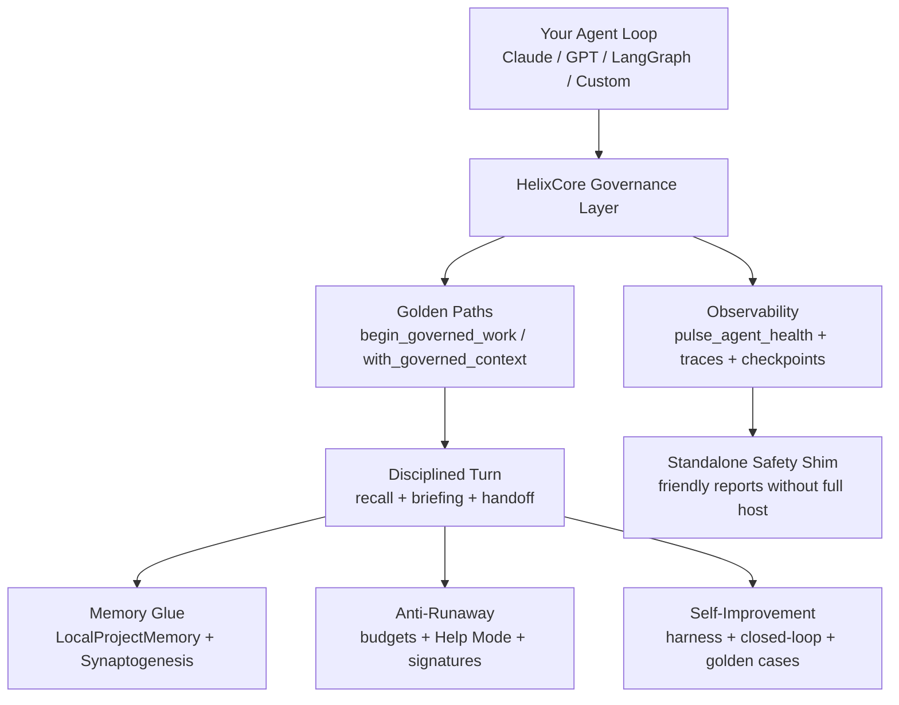

# HelixCore

**Portable, governed agentic patterns for disciplined, observable, and self-improving AI workflows.**

[](https://www.python.org/)
[](https://opensource.org/licenses/MIT)
[](https://github.com/Goliaith/helixcore)

HelixCore is the "operating system" for serious agentic work. It gives you:

- Explicit **phase handoffs** and decision tracking that carry context across sessions
- **Memory glue** (Synaptogenesis) that connects ideas across projects without external RAG
- **Anti-runaway protection** and governance that has been stress-tested to risk=0
- **Closed-loop self-improvement** with evaluation harness and golden cases
- **Health pulses** and observability that make long-running work visible and safe
- Full **local-first** stack (no mandatory cloud or host dependencies)

It works **completely standalone** or layered on top of LangGraph, CrewAI, LlamaIndex, custom ReAct loops, Claude, GPT, or any other model or framework.

> "The governance layer is the value — you bring the model calls."

## Why This Exists

Most agent frameworks are great at *calling models* but weak at *running reliable, long-lived, multi-turn, self-improving processes*.

HelixCore fills that gap with battle-hardened patterns developed and hardened over 5 weeks of intensive internal dogfooding and rapid public-readiness work in June 2026 (including extreme stress tests, cross-study SRSI experiments, and targeted external-usability hardening).

It is explicitly designed for **external use** — no Grok, no TUI, no proprietary host required.

## Quick Start (External / Standalone)

```bash
# From the repo or after pip install
git clone https://github.com/Goliaith/helixcore.git
cd helixcore
pip install -e .

python -c "from helixcore import begin_governed_work, pulse_agent_health, get_status_report, configure; print('HelixCore ready')"
```

```python
from helixcore import (
    begin_governed_work,
    record_phase_handoff,
    persist_decision,
    pulse_agent_health,
    get_status_report,
    configure,
)

# Optional: point state anywhere (great for Docker, per-project isolation, or Claude-only envs)
# configure(home="/tmp/my-claude-agents")  # or set HELIXCORE_HOME env var before import

result = begin_governed_work(
    task_slug="build-feature-x-with-claude",
    initial_focus="Implement the new parser + tests using Claude 3.5",
    mode="standard"  # or "light" for less ceremony
)

# ... your normal agent loop that calls Claude (or any model) ...

record_phase_handoff(
    "Design and initial implementation complete. Key decisions logged.",
    next_focus="Evaluation + error analysis",
    task_slug="build-feature-x-with-claude"
)

persist_decision(
    "build-feature-x-with-claude",
    "Chose recursive descent parser over regex because it handles the edge cases in the spec cleanly.",
    category="implementation"
)

health = pulse_agent_health()
print(health.get("registry", "No registry"))   # Friendly standalone output

status = get_status_report(friendly=True)
print(status)  # Beautiful plain-English health even with no external safety scripts
```

See the [30-minute on-ramp](docs/HELIXCORE_IN_30_MINUTES.md) for the fastest way to feel the patterns in action.

## Architecture at a Glance



**The 6 Pillars** (harvested from real dogfooding):
1. Governance & Self-Improvement
2. Explicit Orchestrator Coordination & Routing
3. Project Memory Glue & Federation (Synaptogenesis)
4. Anti-Loop / Runaway Protection
5. Evaluation / Golden-Case Harness + Closed-Loop
6. Meta-Audit & Self-Improvement Cycles

All of this is available through a small, importable Python package.

## External / Public Readiness (2026-06 Hardening)

We explicitly hardened the library for use *outside* any host TUI or grok-build environment:

- Packaging/import fixes so `import helixcore` works cleanly from pip or source
- `configure()` + `HELIXCORE_HOME` / `HELIXCORE_STATE_DIR` / `HELIXCORE_SAFETY_DIR` for full path control
- Graceful standalone safety shims (no crash if you don't bring the full `~/.grok/safety/` scripts)
- `get_status_report()` that gives beautiful friendly output in pure external mode
- Validated with multiple clean isolated external dogfood runs (separate USERPROFILE + PYTHONPATH only pointing at the package)

Result: **10/10** on the public readiness checklist.

See the full [Public Readiness Summary](docs/HelixCore_Public_Readiness_Summary_2026-06-07.md) for before/after, exact open items we fixed, and the external dogfood logs.

**It works with Claude** (or any other model). You bring the LLM client; HelixCore brings the discipline, memory, and safety.

## Installation (No Pre-built Wheel Required)

The repository contains the complete source. You do **not** need a pre-built wheel to install.

### Recommended: Editable install from clone (best for development/experimentation)

```bash
git clone https://github.com/Goliaith/helixcore.git
cd helixcore
pip install -e .
```

### One-liner install directly from Git

```bash
pip install git+https://github.com/Goliaith/helixcore.git
```

### Build your own wheel locally (if you prefer a .whl)

```bash
pip install build
python -m build
```
Then install the generated wheel from the `dist/` directory.

After installation, verify with:

```bash
python -c "from helixcore import begin_governed_work, get_status_report, is_standalone_mode; print('HelixCore ready (standalone mode:', is_standalone_mode(), ')')"
```

## Key Public APIs

**High-level (Golden Paths)**
- `begin_governed_work(task_slug, initial_focus, mode="standard")`
- `with_governed_context(...)` — lighter ceremony for medium tasks
- `perform_synthesis(...)`, `governed_research_initiative(...)`, etc.

**Core primitives**
- `persist_decision`, `record_phase_handoff`, `capture_milestone`
- `pulse_agent_health()`, `get_status_report()`
- `configure(...)`
- `list_checkpoints`, `time_travel_replay`, `save_checkpoint`

**Local stack (no external RAG required)**
- LocalCodeIntel (fast symbols, smart edits)
- LocalProjectMemory + LocalSemanticMemory + Synaptogenesis
- Serendipity (optional chroma hybrid)

Full list in `helixcore/__init__.py` and the docs.

## Helpful Commands & One-Liners

These are the most useful commands people reach for when getting started or debugging in a standalone/external environment.

### Verify installation
```bash
python -c "from helixcore import begin_governed_work, pulse_agent_health, get_status_report, configure, is_standalone_mode; print('HelixCore ready (standalone:', is_standalone_mode(), ')')"
```

### Quick friendly health check (standalone shim)
```bash
python -c "from helixcore import get_status_report; print(get_status_report(friendly=True))"
```

### Pulse (structured data for scripts/tools)
```bash
python -c "from helixcore import pulse_agent_health; import json; print(json.dumps(pulse_agent_health(), indent=2, default=str)[:2000])"
```

### Run with completely isolated state (recommended for external/Claude-only use)
```bash
HELIXCORE_HOME=/tmp/my-helixcore-project python -c "from helixcore import begin_governed_work, get_status_report; begin_governed_work('test-task', 'Quick isolated test'); print(get_status_report(friendly=True))"
```

### Explicit configure (inside code)
```python
from helixcore import configure, begin_governed_work, get_status_report
configure(home="/tmp/my-project")
begin_governed_work("my-task", "Do something important")
print(get_status_report(friendly=True))
```

### Start a light governed task + handoff + decision
```python
from helixcore import begin_governed_work, record_phase_handoff, persist_decision, pulse_agent_health

begin_governed_work("demo-task", "Explore HelixCore in 2 minutes", mode="light")
record_phase_handoff("Step 1 done", "Add a decision now", "demo-task")
persist_decision("demo-task", "Chose light mode because it felt right for a quick demo.")
print(pulse_agent_health()["active_session_count"])
```

### List available Golden Paths
```python
from helixcore import list_golden_paths
for p in list_golden_paths():
    print(f"- {p['name']}: {p.get('recommended_for', p.get('description', ''))[:60]}...")
```

### Run the simple external example (Claude or any LLM)
```bash
python examples/simple_claude_dogfood.py
```

### Clean up old isolated state (if using custom HOME)
```bash
rm -rf /tmp/my-helixcore-project/.grok
```

These commands work the same whether you're using Claude, another LLM, or a full agent framework.

## Project Structure

```
helixcore/
├── helixcore/                 # The importable package
│   ├── __init__.py
│   ├── golden_paths.py
│   ├── orchestrator_mcp/     # Core governance engine
│   ├── local_code_intel.py
│   ├── local_semantic_memory.py
│   └── ...
├── docs/                     # All guides + readiness report
├── examples/                 # Practical usage examples
├── pyproject.toml
├── README.md
├── LICENSE
└── .gitignore
```

## Status & Roadmap

- Public release candidate (v0.3.0)
- Recent focus: external usability (Claude-friendly, standalone safety, configurability) — completed in 5 weeks of focused work
- Next: more examples, full wheel on PyPI, richer standalone demo

Contributions, real-world usage reports, and feedback on the external experience are very welcome.

## License

MIT — see [LICENSE](LICENSE).

---

*Developed and hardened over 5 weeks of intensive internal dogfooding and public-readiness work in June 2026. The patterns are the product.*